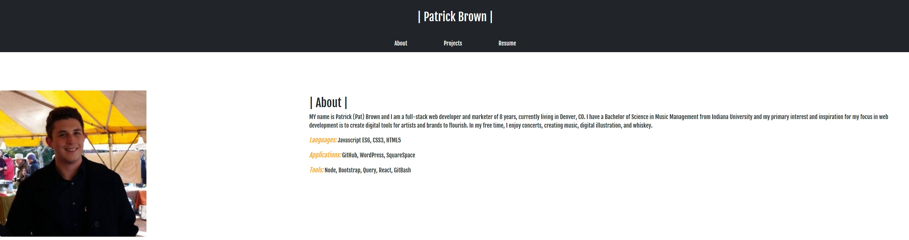

# Updated Portfolio Page - Homework 08

## Description

This is the Bootstrap/Project 1 Update to my personal portfolio. I have revised the look of the page entirely from Homework 02, encorporating modern Bootstrap design as well as all the CSS tricks I have learned in the last month so a potential employer can see my work and samples, as well as resume and links to all social and professional contact profiles (GitHub, LinkedIn)

## Installation

- To see the porfolio, visit my [Github Pages Deployment.](https://patrickbrown-io.github.io/patrick-brown-portfolio/)

## Usage

I am available for content-creation, web-development, brand identity and more. You are welcome to forward this to any member(s) of your organization responsible for hiring outreach.

## Credits

[Patrick Brown](https://github.com/patrickbrown-io)

## Features

Bootstrap

## How to Contribute

Feel free to help me add to my projects list-- I am open to work.
